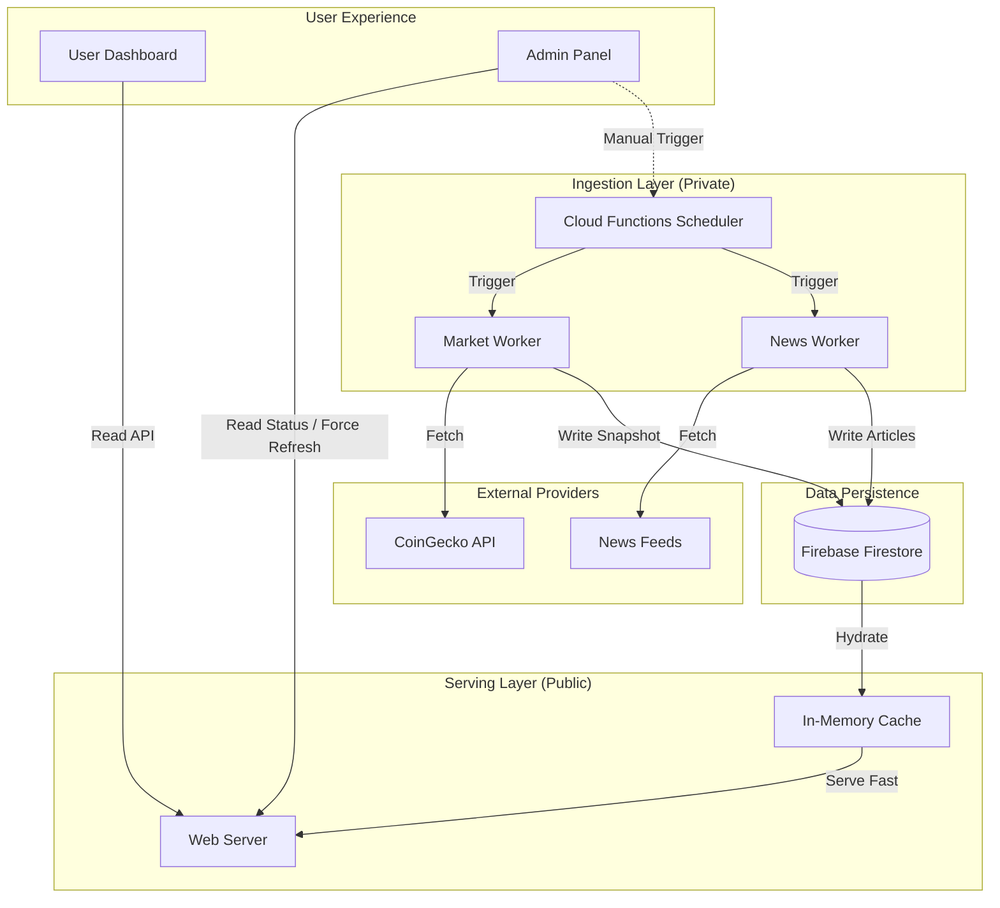

# GOLDH System Architecture Overview

**Date:** January 15, 2026
**Audience:** Executive Leadership, Product, Marketing

## 1. Executive Summary
The GOLDH platform utilizes a **hybrid architecture** that separates data ingestion from user traffic. This ensures high performance for users (sub-millisecond data retrieval) while maintaining reliable, scheduled synchronization with external financial data providers.

---

## 2. External Data Sources & Integration
We rely on two primary external categories for market intelligence.

| Data Source | Provider(s) | Purpose | Type | Frequency |
|:--- |:--- |:--- |:--- |:--- |
| **Market Data** | **CoinGecko API** | Global crypto prices, market caps, and 24h changes. Tracks top 100 assets. | Snapshot | Hourly |
| **News Feed** | **CoinDesk, Cointelegraph** | "Guru Talk" news aggregation. Ingests RSS feeds for latest headlines. | Snapshot | Every 2 Hours |

**Key Takeaway:** We do not stream real-time tick-by-tick data (e.g., binance websocket). We take "snapshots" to provide a macro view of the market, optimizing for cost and stability rather than day-trading speed.

---

## 3. Data Refresh & Reliability
Our system runs on an automated "Heartbeat" schedule to keep data fresh without human intervention.

*   **Automated Scheduling:**
    *   **Market Pulse:** Updates every **60 minutes**.
    *   **News Digest:** Updates every **120 minutes**.
    *   *Note: Schedules include random "jitter" (±15s) to prevent traffic spikes.*

*   **Failure Handling:**
    *   If a data provider is down, the system **automatically logs the error** and serves the previous successful snapshot.
    *   The frontend detects "stale" data (older than 90 mins) and can warn the user, but the site remains fully functional.

*   **Manual Controls:**
    *   Admins have a **"Force Refresh"** button in the Health Dashboard to trigger an immediate update outside the normal schedule.

---

## 4. Backend Architecture
We utilize a **Serverless Ingestion / Dedicated Serving** model.

### 4.1. Separation of Concerns
*   **Ingestion (Writes):** Handled by **Google Cloud Functions**. These are serverless scripts that wake up, fetch data, write to the database, and shut down. They are completely isolated from user traffic.
*   **Serving (Reads):** Handled by our optimal **Node.js Web Server**. This server focuses purely on delivering content to users quickly.

### 4.2. Caching Strategy (The "Speed Layer")
To ensure the site feels instant, we use a 3-tier caching strategy:
1.  **Level 1 (Memory):** The web server keeps the latest data in RAM. Response time: **< 5ms**.
2.  **Level 2 (Database):** If memory is empty, we read from **Firestore**. Response time: **~100ms**.
3.  **Level 3 (Source):** Cloud Functions update Firestore in the background.

**Push vs. Pull:** We use a **Push** model. The background jobs "push" new data to the database, so the user never has to wait for us to "pull" from CoinGecko.

---

## 5. Frontend & Performance
*   **Data Delivery:** The frontend (React) requests data from our internal API, not directly from external providers. This hides our API keys and rate limits from the public.
*   **Smart Transparency:** The UI knows the source of its data. It can display indicators like "Live", "Cached", or "Degraded" based on headers sent by the server.
*   **Performance:** Because we serve from memory cache, users experience near-instant page loads for market data, even during high traffic.

---

## 6. Security & Governance
*   **Admin-Only Actions:** Critical operations (like forcing a data refresh) are protected by strict permissions. Only users with the `admin` flag in their profile can execute them.
*   **Secret Management:** Sensitive credentials (like the CoinGecko API Key) are stored in secure environment variables, never in the code repository.
*   **Duplicate Protection:** We use "Distributed Locks" to ensure two scheduled jobs never run at the same time, preventing data corruption and double-spending on API quotas.

---

## 7. Simplified Architecture Diagram

### Flow description:
1.  **Ingest:** Cloud Functions wake up periodically to fetch data from External Providers.
2.  **Store:** Data is saved to the central Database (Firestore).
3.  **Cache:** The Web Server detects updates and loads them into rapid Memory Cache.
4.  **Serve:** Users get data instantly from the Web Server's cache.
