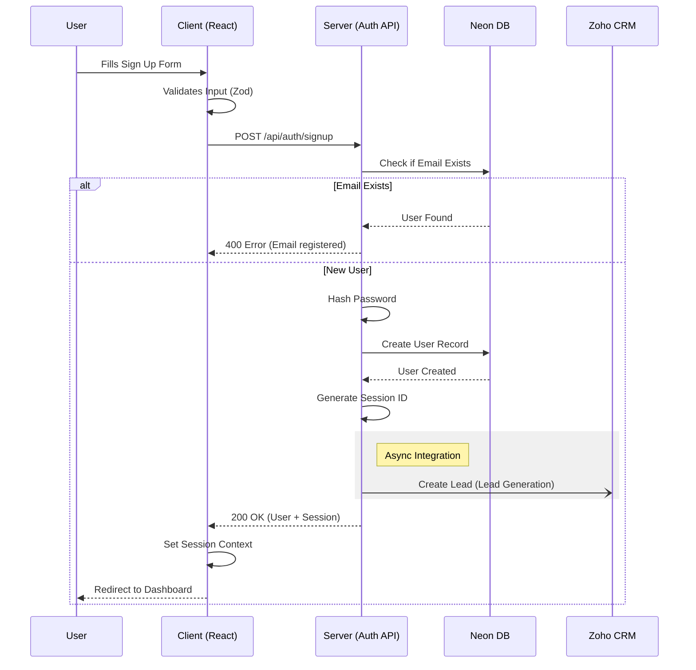
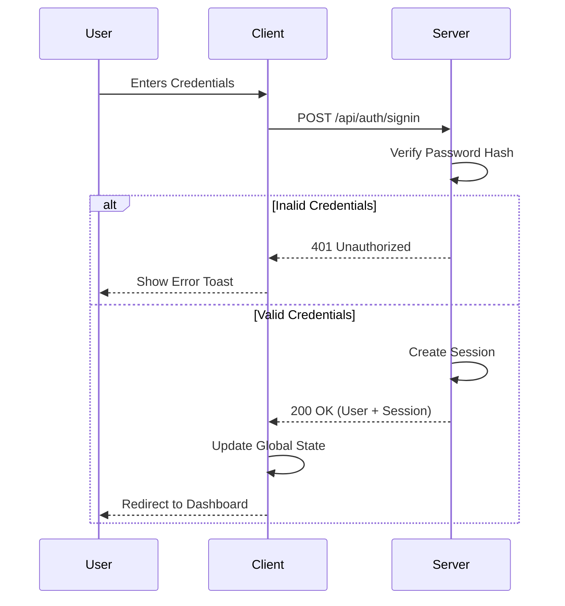

# Authentication Module

## 1. Executive Summary
*   **Objective:** Securely manage user identity and access control across the platform.
*   **Strategic Health:** 🟢 **Stable** - Core session-based auth is implemented and verified.
*   **Value:** Verified user identity is the foundation for personalization (Pillar A) and regulatory compliance (Pillar B).

## 2. Functional Overview (Rule 25)

The Authentication module handles user onboarding (Sign Up), session management (Sign In/Out), and access control.

### Sign-Up Flow
The Sign-Up process includes form validation, user creation, and asynchronous lead generation in Zoho CRM.

### Sign-In Flow
Standard email/password authentication with secure session management.

## 3. Technical Implementation

### API Endpoints
| Endpoint | Method | Purpose | Payload | Response |
| :--- | :--- | :--- | :--- | :--- |
| `/api/auth/signup` | POST | Register new user | `SignUpData` (Name, Email, Pass, Phone, Exp) | User Object + Session ID |
| `/api/auth/signin` | POST | Authenticate user | `{ email, password }` | User Object + Session ID |
| `/api/auth/signout` | POST | End user session | `{}` | Success Message |

### Data Schema (User Object)
Core fields stored in `users` table (Neon Postgres).

| Field | Type | Required | Notes |
| :--- | :--- | :--- | :--- |
| `id` | Integer | Yes | Primary Key |
| `email` | String | Yes | Unique Index |
| `password` | String | Yes | Bcrypt Hash |
| `isAdmin` | Boolean | No | Auto-granted via config allow-list |
| `isPremium` | Boolean | No | Default: `false` |
| `experienceLevel` | String | Yes | Enum: `new-to-crypto`, `enthusiast`, `investor` |

### Security Features
*   **Password Hashing:** Utilizing `scrypt` or `bcrypt` (implementation dependent) for secure storage.
*   **Session Management:** Server-side session storage mapped to User ID.
*   **Input Validation:** Strict Zod schema validation on both client and server (see `@shared/schema`).
*   **Admin Access:** Hardcoded admin email list in `schedulerConfig.adminEmails` auto-grants Access Control privileges upon login.
